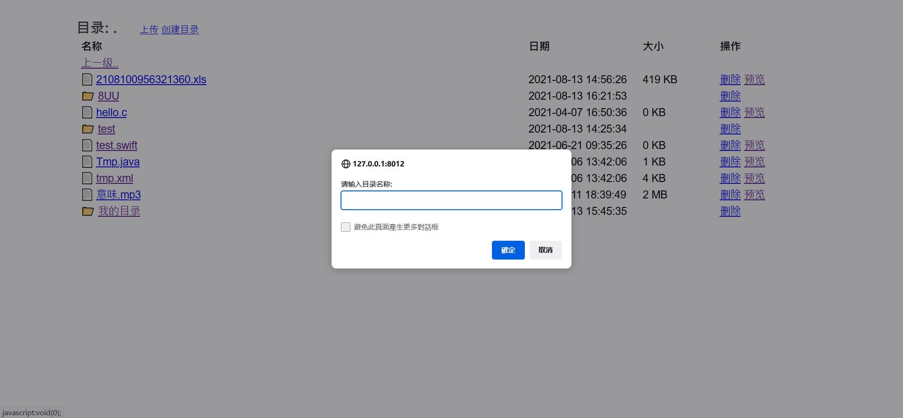
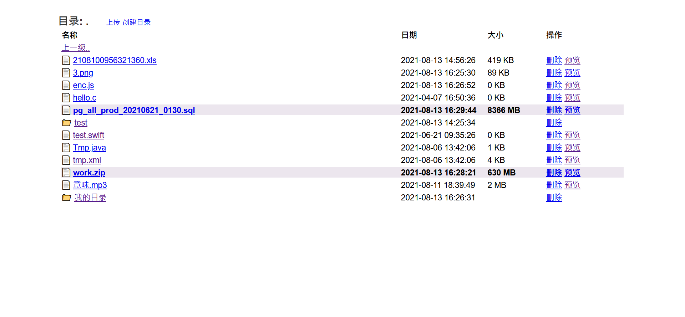
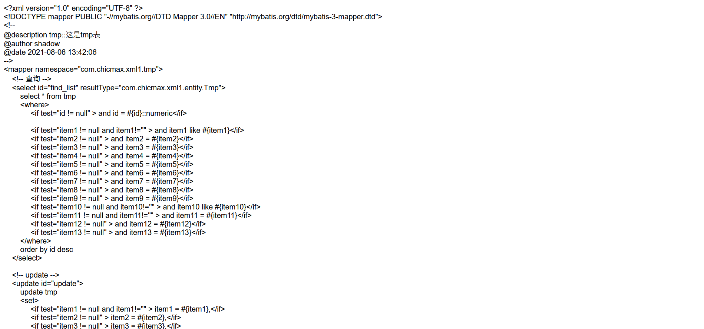

## mee_file文件系统

### 写在前面

  这是一个简易的文件系统，小巧但功能俱全;特点儿是:快(堪称急速)、小巧、灵活、易用、使用友好(开发人员及非开发人员) 等等~
  
  
### 基础功能
+ 可视化友好界面方便非用户操作
+ 权限控制:支持管理人员及非管理人员
+ 文件上传、文件预览、文件下载
+ 上传支持大文件(可多文件上传)
+ 支持目录管理
+ 开发人员接口(提供完整安全的上传、下载、查看、验证接口)
+ 其它~(开发中，缺陷及需求欢迎提`issues`)

### 预览
>登录

>主页

>目录管理

>预览

### 使用
#### for windows平台
+ 下载`./bin`目录下`mee_file_windows_x64.exe`及`.env`文件
+ 保持 `mee_file_windows_x64.exe` 、`.env` 同一目录
+ 打开`.env`文件，配置`BASE_DIR`(挂载目录)，`CONTEXT_PATH`、`SERVER_PORT`等为选配目录
+ 双击`mee_file_windows_x64.exe`
+ 浏览器访问`http://127.0.0.1:${SERVER_PORT}/${CONTEXT_PATH}`(默认为_http://127.0.0.1:8012/mee_file_)
+ 登录用户名密码默认为 `admin `\ `1299`(可在_`.env`文件内配置)

#### for linux
+ 下载`./bin`目录下`mee_file_linux`及`.env`文件
+ 保持 `mee_file_linux` 、`.env` 同一目录
+ 打开`.env`文件，配置`BASE_DIR`(挂载目录)，`CONTEXT_PATH`、`SERVER_PORT`等为选配目录
+ 赋权 `chmod a+x mee_file_linux`
+ 执行 `nohup ./mee_file_linux &`
+ 浏览器访问`http://127.0.0.1:${SERVER_PORT}/${CONTEXT_PATH}`(默认为_http://127.0.0.1:8012/mee_file_)
+ 登录用户名密码默认为 `admin `\ `1299`(可在_`.env`文件内配置)

#### for macOs
  
  暂不清楚`macOs`是否支持`linux`可执行包，若不支持，可使用`源码编译`，下面有提供编译之步骤
  
### 开发
+ 安装 `rust` -> `curl --proto '=https' --tlsv1.2 -sSf https://sh.rustup.rs | sh`

+ 运行
  `cargo run`
  
+ 访问
  `http://127.0.0.1:8012/mee_file`
  
+ api
  - 验证[GET]
  `http://127.0.0.1:8012/api/auth`
  
  - 上传(POST)
  `http://127.0.0.1:8012/api/upload`
  
  - 目录文件[GET]
  `http://127.0.0.1:8012/api/list`
  
  - 下载[GET]
  `http://127.0.0.1:8012/api/download`
  
+ 密钥: `.env`文件内`COMMON_KEY`配置项

+ 打包
  - `cargo build --release`
  - `cd target/release`
  - `mee_file.exe` 即是
  
  - 若加壳(需安装upx): 
  
    `upx --backup --brute mee_file.exe`

### issues
+ 列表样式调整[完成]
+ 上传文件限制(限制256MB)[暂无限制]
+ 删除目录及文件(目录下有文件则不可删除)[完成]
+ 创建目录[完成]
+ 文件预览[0.1版]
+ api接口优化[完成]
+ 文件下载功能(异步实现)
+ 文件分享功能
+ 目录权限功能
+ 多文件上传错误问题 [基本解决]
+ 重命名功能
+ 上传进度
+ `400`、`500`响应处理
+ 
+ 